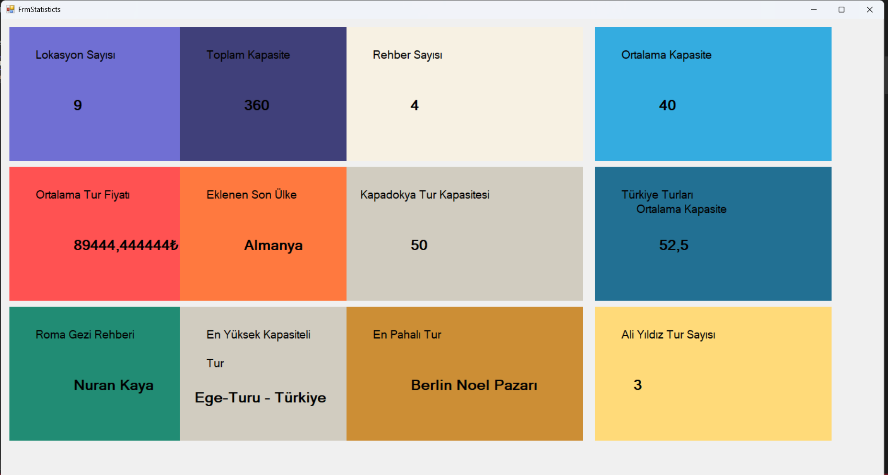

📌🚀 C# EĞİTİM KAMPI PROJELERİ

Bu repo, Murat Yücedağ’ın C# Eğitim Kampı süresince tamamladığım ilk 8 projeyi içeriyor.
Her projeyle yeni bir konu öğrendim ve bunları uygulayarak kendimi geliştirme fırsatı buldum.

📌 Proje 1: Merhaba Dünya!

Konsola yazı yazdırmanın mantığını kavradım. Console.WriteLine() ile ilk çıktılarımı aldım, Console.ReadLine() ile konsol ekranından veri okumayı öğrendim  ve program yapısını keşfettim. 🌍

📌 Proje 2: Değişkenler

int, string, double gibi veri tipleriyle değişken tanımlamayı öğrendim. Farklı tiplerle işlem yaparak pratiğimi artırdım. 🔢

📌 Proje 3: Diziler (Arrays)

Birden fazla değeri tek bir yapı içinde saklamanın yolunu öğrendim. Döngülerle bu verilere erişip işlem yapmayı denedim. 🧩

📌 Proje 4: Karar Yapıları (If-Else)

if, else if, else kullanarak farklı senaryolara göre karar alabilen yapılar oluşturdum. Programın akışını koşullara göre yönettim. ⚖️

📌 Proje 5: Döngüler (Loops)

for, while ve foreach döngüleriyle tekrar eden işlemleri kolayca çözdüm. Özellikle büyük veri gruplarında pratik oldu. 🔄

📌 Proje 6: Metotlar (Methods)

Kodları daha düzenli hale getirmek için metotlar yazdım. Parametre alıp sonuç döndüren yapılar kurarak tekrar kullanılabilir kodlar geliştirdim. 🛠️

📌 Proje 7: Foreach Döngüsü ve Sınav Sistemi

foreach döngüsünü kullanarak basit bir sınav sistemi yaptım. Öğrencilerin notlarını toplayıp ortalamalarını hesapladım, geçip geçmediklerini belirledim. 🎓

📌 Proje 8: Geriye Değer Döndüren Fonksiyonlar

Kullanıcıdan aldığım verileri işleyip geriye sonuç döndüren fonksiyonlar yazdım. Daha karmaşık işlemleri bu projeyle öğrenmiş oldum. 🎗️

📌 Proje 9: Temel Database İşlemleri

Veritabanı bağlantıları ve veritabanından veri okumayı öğrendim

📌 Proje 10: Temel CRUD operasyonları

Temel CRUD operasyonlarını öğrendim

📌CSharpEgitimKampi301 

Entity Framework Metotlarını öğrendim ve tur projesini tamamladım

